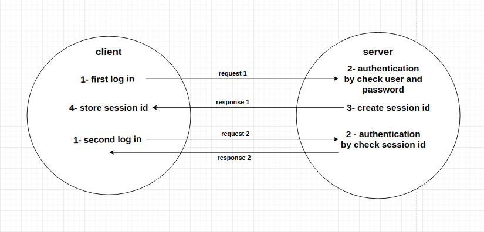
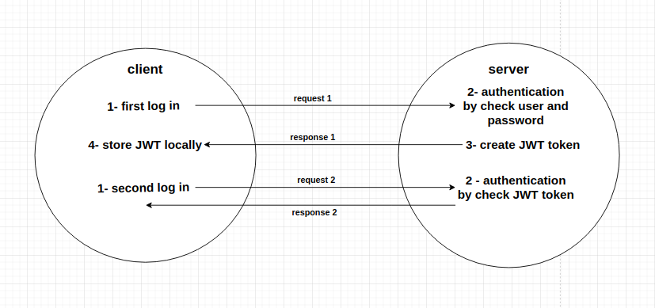

# Week7-Research-KhamisHesham

## HTTP vs HTTPS :
1. ### How does HTTPS work ?
It's a protocol for exchanging information between client and server, This information is encrypted with an SSL certificate
and it converts information into code .

2. ### What are TLS/SSL certificates ?
They are protocols that provide a secure connect between the client and the server, but the TLS using strong encryption algorithms .

3. ### Why is this important to implement in your projects ?
Because the project contains sensitive user data .

4. ### Demo how to generate certificates and use them in a node project !
```
const https = require('https');
const fs = require('fs');

const options = {
    key: fs.readFileSync('privkey.pem'),
    cert: fs.readFileSync('cert.pem')
};

const app = https.createServer(options, (req, res) => {
    res.end("Khamis");
})listen(3000);

```
--- 

## Stateless vs stateful authentication :
1. ### What is session based authentication (stateful) vs token based authentication (stateless) ?
- What is session based authentication (stateful) : When the user logs in, for example, he enters the name and password, the server checks his data, and create the session id, and store it in database and session storage .
- What is token based authentication (stateless) : When the user logs in, for example, he enters the name and password, the server checks his data, and the server creates token, and store it in cookies .
2. ### Draw flow diagrams to show the steps involved in each process !
- #### Stateful Authentication Diagram :


- #### Stateless Authentication Diagram :


3. ### What are the advantages and disadvantages of each ?
- Advantages and disadvantages of stateful authentication : 
  - Advantages :
     - Revoke the session anytime.
     -  It is impossible to steal session information from the session identifier because it is just an identifier associated with the session .
     - Easy to implement and manage for one-session-sever scenario .

  - disadvantages :
    - Increasing server overhead .
    - While adding new instances, there is a need to implement additional scale to session storage as well .
    - Takes up database space .


- Advantages and disadvantages of Stateless authentication :
  - Advantages :
    - Lower server overhead .
    - Adding new service instances does not require additional effort .
    - The arrival and verification time is less .
    - not takes up database space , benefiting storage .

  - disadvantages :
    - Session data cannot be changed until its expiration time .
    - To decrypt session information from a token, all parts of the system should share the same key. And, if at least one system is compromised, all parts of the system are under the threat .
    - Reliant on secrecy of server side secret .
    ---

## Session-management in Express :
1. ### What are sessions ?
The data deleted when browser windows closed by a web user .

2. ### What are the different ways of managing sessions in express ?
- express-session :
stores just a mere session identifier within a cookie in the client end, while storing the session data entirely on the server.
- cookie-session :
used for lightweight session applications where the session data is stored in a cookie but within the client (browser).

3. ### Create a minimal example of how to set up a session (FYI: pseudo code is fine) 
```
const express = require('express');
const session = require('express-session');
const app = express();
app.set('trust proxy', 1);
app.use(session({
  secret: 'keyboard cat',
  resave: false,
  saveUninitialized: true,
  cookie: { secure: true }
}));
```
---

## Attacks :
### What are the following types of attack?
1. Man In The Middle (MITM) :
is a type of attack that involves a malicious element “listening in” on communications between parties .


    - MITM Techniques :
       - ARP Cache Poisoning .
       - DNS Cache Poisoning .
       - HTTPS Spoofing .
       - Wi-Fi Eavesdropping .
       - Session Hijacking .

    - How can you defend against MITM ?
       - encrypting the traffic between the network and your device using browsing encryption software .
       - make sure the sites you're visiting are secure. Most browsers show a lock symbol next to the URL when a website is secure .
       - Regularly audit and monitor your networks .

2. Cross Site Scripting (XSS) :
is a code injection attack that allows an attacker to execute malicious JavaScript in another user's browser.
   - Types of XSS :
      - Persistent XSS .
      - Reflected XSS .
      - DOM-based XSS .
   - How can you defend against XSS ?
      - Filter input on arrival .
      - Encode data on output .
      - Use appropriate response headers .
      - Content Security Policy .

3. Cross Site Request Forgery (CSRF) :
is a web security vulnerability that allows an attacker to induce users to perform actions that they do not intend to perform .
   - How can you defend against CSRF ?
     - Anti-CSRF Token :
     An anti-CSRF token is a type of server-side CSRF protection. It is a random string that is only known to the user’s browser and the web application. The anti-CSRF token is usually stored inside a session variable. On a page, it is typically in a hidden field that is sent with the request .
     - Use SameSite cookies :
     The same-site cookie attribute can be used to disable third-party usage for a specific cookie. It is set by the server when setting the cookie, and requests the browser to only send the cookie in a first-party context, i.e. when you are using the web application directly. When another site tries to request something from the web application, the cookie is not sent . 